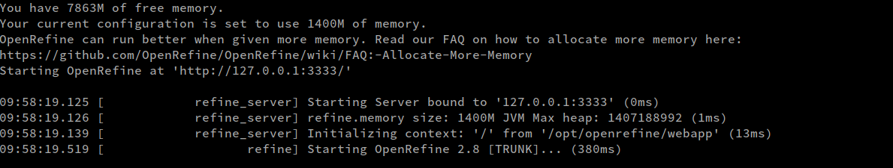

# Introduction à Julie
Je suis sur le comité directeur d'OpenRefine! Si vous avez des questions ou des commentaires, je peux _peut-être_ y répondre pour vrai!
Écrivez-moi à julie.faure-lacroix@calculquebec.ca


# Introduction à OpenRefine
Vous pouvez télécharger OpenRefine à cette addresse
[http://openrefine.org/](http://openrefine.org/)

## Pourquoi utiliser OpenRefine?
1. pour garder une trace de ce qu'on a fait à nos données
2. parce qu'on peut annuler une action facilement
3. parce qu'OpenRefine ne modifie pas le fichier original, il crée une copie
4. parce qu'on peut sauvegarder des routines et le appliquer à d'autres fichiers
5. parce qu'il contient des algorithmes d'aggrégation puissants

## Quelques notes sur OpenRefine
1. OpenRefine a été initialement conçu par Google sous le nom de **Google Refine** et lorsque le financement a été épuisé pour le projet, il est devenu un projet ouvert sous le nom d'OpenRefine.
2. OpenRefine est une application Java et **une _sorte_ de Java** a été développé spécialement pour OpenRefine. Il s'agit d'un langage appelé ***GREL (General Refine Expression Language)***.
3. Il existe un **forum** pour OpenRefine: 

[https://forum.openrefine.org/](https://forum.openrefine.org/)

>**La doc s'est beaucoup améliorée depuis les débuts, mais elle n'est pas parfaite et ça vaut la peine de regarder les groupes de discussion. La documentation est hébergée dans une dépôt Github et vous pouvez y contribuer (on a besoin de traducteurs)!**
[https://openrefine.org/docs](https://openrefine.org/docs)

4. OpenRefine est relativement performant jusqu'à une concurrence de **100 000 lignes**. Il est peu recommandé d'utiliser OpenRefine sur des fichiers de millions de lignes pour des questions de performance. Cependant, il est possible de modifier la mémoire vive utilisée pour accomoder des traitements de données plus massifs.
[https://openrefine.org/docs/manual/installing#using-openrefineexe](https://openrefine.org/docs/manual/installing#using-openrefineexe)

5. Bien que OpenRefine soit un logiciel ouvert, peu de versions modifiées sont actuellement actives et aucune ne permet de faire du traitement parallèle.

## Installer OpenRefine (à faire sur votre ordinateur personnel)
Il n'y a pas vraiment d'application à installer pour utiliser OpenRefine. Cependant, assurez-vous que **Java** est installé et à jour.

Vous devriez avoir téléchargé OpenRefine et extrait les fichiers à un emplacement sur votre ordinateur. Sous **Windows**, vous pouvez vous rendre à l'endroit où les fichiers sont extraits et double-cliquer "openrefine.exe". Sous **Mac et Linux**, utilisez un terminal pour vous rendre à l'endroit où sont placés les fichiers et exécutez 

``` ./refine ```

Sous **Linux et hypothétiquement sous Mac avec Homebrew**, il se pourrait que vous puissiez installer OpenRefine et ensuite l'exécuter dans le terminal avec la commande 

``` openrefine ```

Lorsqu'OpenRefine est lancé, vous devriez avoir un terminal (peu importe votre système d'exploitation).



Une page web devrait s'ouvrir. Si ce n'est pas le cas, ouvrez un navigateur et allez à l'addresse http://127.0.0.1:3333/.

## Utiliser OpenRefine
### Dans le cadre de la session de cours
Nous allons 
### Récupération des données
Nous allons maintenant récupérer des données provenant **de la base de données ouvertes de la ville de Montréal** 

[http://donnees.ville.montreal.qc.ca/dataset/declarations-exterminations-punaises-de-lit](http://donnees.ville.montreal.qc.ca/dataset/declarations-exterminations-punaises-de-lit)

Ce sont des données de déclarations de punaises de lit sur l'île de Montréal. Notez l'information mentionnée sur concernant le jeu de données:

>Déclarations des gestionnaires de parasites. Les formulaires de déclaration ont été soumis depuis le 5 juillet 2011. Les données ont un faible degré de fiabilité car elles sont consignées manuellement par des tiers, soit les gestionnaires de parasites et ne font l'objet d'aucune validation de la part de la Ville de Montréal.

Ce sont donc des données parfaites pour s'exercer!
Vous devriez avoir **extrait le fichier csv sur votre ordinateur.**

### Création d'un projet
OpenRefine peut importer plusieurs types de fichiers: **tsv (tab separated), csv (comma separated), xls, xlsx, JSON, XML, RDF as XML, Google Spreadsheets**, etc. 

1. Dans l'onglet **"Create Project"** 
2. Cliquez **"Choose Files"** pour chercher le fichier csv sur votre ordinateur
 - Pour les données d'extermination de punaises de lits, vous pouvez sélectionner l'onglet _Web Addresses (URLs)_ et coller [https://data.montreal.ca/dataset/49ff9fe4-eb30-4c1a-a30a-fca82d4f5c2f/resource/6173de60-c2da-4d63-bc75-0607cb8dcb74/download/declarations-exterminations-punaises-de-lit.csv]
3. Cliquez **"Next"**.
4. Vous devriez voir un **aperçu du fichier**.
5. OpenRefine est maintenant assez apte à auto-détecter l'encodage (UTF-8), mais il se pourrait que vous deviez **changer l'encodage (change encoding)**
6. Jouez dans le bas avec les types de séparation de fichiers pour voir les résultats.
7. Si tout vous semble correct, donnez un nom **à la copie du fichier**, ajoutez un **tag suivi de tabulation** et cliquez **"Create Project"**.
8. Jetez un coup d'oeil aux noms des colonnes.
9. Une fois le projet créé, vous pouvez retourner dans **Open Project** et éditer les métadonnées de votre projet.

### Filtres de texte
Dans OpenRefine, les manipulations se font le plus souvent sur les **colonnes**. On peut aussi voir qu'il y a des **lignes** et chaque information est contenue dans une **cellule**.


**Chaque colonne a un menu**. Vous pouvez commencer par faire un **"Text filter"** sur la colonne NOM_ARROND et explorer avec des mots clés. Cependant, il est difficile de déterminer les mots clés à utiliser sans connaître le jeu de données à l'avance.

### Application de regroupements (_facetting_)
Cette étape est la plus importante d'OpenRefine. Elle vous permettra d'explorer et de vous familiariser avec les données. C'est particulièrement utile lorsqu'on a d'assez gros jeux de données. Le facetting nous permet d'avoir une **vue d'ensemble de jeux de données complexes** et de commencer à les explorer plus en détail.

Les filtres (**_facets_**) vous permettent d'agglomérer certaines données et d'effectuer des modifications sur ces groupes de données. 


#### _Text Facets_

Prenons la **première colonne avec le nom des arrondissements**. Si on clique la flèche et **Facets** puis **Text Facets**, une boîte s'ouvre avec les différentes écritures des noms d'arrondissements.

>Comme les entrées ont été faites par de multiples personnes et avec des accents, c'est un peu le bordel.

Si on ***maintient le mot dans la boîte de filtre text***, on peut avoir un _facetting_ juste pour ce mot. Si on enlève la recherche texte, on a toute la colonne arrondissements. On peut avoir le compte pour chaque arrondissement sur le côté et ça nous donne un aperçu rapide.

>Si on changeait un nom directement dans une cellule, on verrait le changement dans _facetting_.


#### Édition

On peut **cliquer directement dans une cellule pour changer manuellement du texte**. Changeons un seul mot et regardons ce qui arrive dans notre _facet_. On peut aussi cliquer "edit" sur une _facet_ et changer toutes les cellules qui font partie de la _facet_.

On peut aussi le faire par ***ligne de code***, surtout lorque ça implique plusieurs modifications similaires sur un grand nombre de cellules. Par exemple, il est courant de travailler avec des jeux de données sans accent. Ça permet de partager les données avec des gens pour lesquels la locale ne permettrait pas l'interprétation de certains caractères spéciaux. 


---
##### Exercice
Par exemple, avec GREL (le langage d'OpenRefine), l'expression **value.replace("é", "e")**  permet de remplacer tous les "é" par des "e" dans toutes les cellules de la colonne sélectionnée. On peu enregistrer la modification et voir ce que ça donne.

>On pourrait aussi écrire replace(value, "é", "e") et c'est certainement plus intuitif pour quelqu'un qui utilise Excel ou R, mais ce ne serait pas la méthode standard de l'écrire dans GREL, qui parle plus à des utilisateurs de Python par exemple.

On peut ajouter des séries de modifications en ajoutant un point et une autre modification, par exemple:

```value.replace("é", "e").replace("Ville-Marie", "Ville-Mario").replace("mot_orig", "nouveau_mot").modification(arguments)```
 

>Un exemple que j'apprécie personnellement

```value.toLowercase().replace("à","a").replace("â","a").replace("á", "a").replace("ä","a").replace("è","e").replace("ê","e").replace("ë","e").replace("é","e").replace("ï","i").replace("î","i").replace("ô","o").replace("ö","o").replace("ü","u").replace("ù","u").replace("ç","c").replace("--","-").replace("  ", "").replace(".", "").replace(" ", "-").replace("/", "-").replace("–", "-").replace("'","")```

Il existe une manière différente de convertir les accents, mais si vous tapez la commande une seule fois et que vous la réutilisez ensuite, le gain de temps n'est pas significatif.

Vous pouvez sélectionner ***"retransform up to N times"*** pour créer des boucles qui vont tenter de retransformer un nombre X de fois. Ex: utile si plusieurs "- - -", "- -", "-"...

---

#### Réutiliser des commandes passées
On peut reprendre des commandes déjà exécutées dans l'onglet _historique_ de l'interface de GREL. C'est très pratique pour réutiliser des commandes dont on prévoit se servir fréquemment.


### Common transformations

#### Trim leading and trailing white spaces

Quand on travaille avec du texte, il y a souvent des cellules avec des espaces blancs au début et à la fin. Toujours, toujours le faire! (La nouvelle version de openrefine permet de faire cette étape dès le début.)

>C'est autre exemple de modification qui peut être faite avec du code et qui coûte rien:

``` value.trim() ```


#### Annuler/Répéter

Cliquer sur le **Undo/Redo** et **cliquer sur l'étape** ou on a commis une erreur. On peut remonter dans le temps jusqu'au point qu'on veut enlever. On peut aussi avancer dans le temps si on est finalement d'accord avec notre choix. On ne peut pas enlever seulement une étape dans le milieu parce qu'il se pourrait que ça ait des répercussions sur les étapes suivantes.

#### Autres Facets

On peut utiliser d'autres _facets_ comme :
1. **Numérique** (montre un graphique, inclue une option "drag-and-drop")
2. **Timeline** (pour des dates)
3. **Scatterplot** (montre un graphique)
4. Définies par l'utilisateur. Exemples par défaut:

    4.1. "Words" éclate un texte et compte les occurences de mots
    
    4.2. "Duplicates"
    
    4.3. "Text length" compte le nombre de caractères dans une cellule. Peut être utile pour dénicher des commentaires entrés dans une cellule Oui/Non
    
    4.4. "Blanks"
    
##### Exercice
Nous pouvons identifier et enlever les doublons d'entrées de formulaire en utilisant le _facet Duplicates_.

>En utilisant la flèche à côté de DATE_DEBUTTRAIT, puis _Facet_, puis _Customized facets_ et _Duplicates facet_ pour trouver les journées ou un seul traitement a été effectué dans la ville de Montréal.


### Regroupements (_clustering_)

Il est possible dans Openrefine d'identifier les erreurs de frappe et les mots écrits au son. Des algorithmes automatiques sont à votre disposition dans le menu **flèche/cluster and edit**

Différentes options s'offrent à vous, qui sont décrites ici https://github.com/OpenRefine/OpenRefine/wiki/Clustering-In-Depth

1. key collision

    Groupe de méthodes les plus rapides car la complexité est linéaire. Méthodes qui créent une représentation alternative d'une valeur (ou une _clé_) qui contient seulement le coeur important d'une chaîne de caractères. Compare ensuite les clés entre elles (_collision_) pour trouver celles qui sont identiques.
    
    1.1. fingerprint    
    
    Produit le moins de faux positifs. Comprend une série d'étapes qui sont décrites ici: https://github.com/OpenRefine/OpenRefine/blob/master/main/src/com/google/refine/clustering/binning/FingerprintKeyer.java
    
    1.2. ngram-fingerprint (ngram size)
    
    Similaire à fingerprint. Choisir une taille de n-gram très élevée n'a pas beaucoup d'avantage, mais une valeur de 1 ou 2 peut trouver des combinaisons que fingerprint ne trouve pas, tout en produisant plus de faux positifs.
    
    1.3. metaphone3
    
    Pour l'anglais. Utilise la prononciation des mots.
    
    1.4. cologne-phonetic
    
    Pour l'allemand. Utilise la prononciation des mots.
    

2. nearest neighbor (kNN)

    Permet de définir une valeur de distance entre les paires de chaînes de caractères. Si deux chaînes de charactères tombent à l'intérieur de cette distance, elle seront agglomérées. Peut prendre énormément de temps!
    
    2.1. levenshtein (radius, block chars)
    
    Mesure le nombre d'opérations de modification nécessaires pour passer d'une chaîne de caractères à l'autre. Bon pour les typos, mais mettre une longue distance maximale peut ralentir le calcul considérablement.
    
    2.2. ppm (radius, block chars)
    
    Implémentation d'un code permettant de comparer des chaînes d'ADN. Méthode produisant généralement beaucoup de faux positifs.


Si vous identifiez un regroupement probable, vous pouvez accepter le remplacement par défaut ou cliquer sur une des façon d'écrire si le remplacement par défaut de correspond pas à celle que vous préférez. S'il y a plusieurs merges similaires possibles, on peut tous les faire d'un coup.

>Le visuel sur le côté peut être utile s'il y a beaucoup beaucoup de clusters et permet de naviguer selon les tailles de cluster.


---
##### Exercice
Dans la colonne NOM_QR, modifiez 3 cellules "Beaurivage" de cette façon:
Borivage
Baurivage
Borrivage

Toujours dans la boîte des noms d'arrondissements, cliquez sur **"Cluster"**. Cluster utilise différents algorithmes de clustering de texte. 

Jouez avec les différents modèles et les différentes options. Fingerprint = précis, Phonetica = pas précis, mais magique. 

Vous pouvez ensuite cocher **"merge"** et cliquer **"Merge selected and recluster"** pour voir si le changement influence quelque chose, ou bien **"Merge and close"** si vous êtes satisfait des modifications.

---

### Créer/Renommer/Diviser des colonnes

Lorsqu'on fait des modifications drastiques à une colonne, c'est possible de vouloir garder la colonne d'origine intacte pour pouvoir évaluer si on a fait les bonnes modifications.

```edit column/add column based on this column.```

>Il faut changer de nom. On peut même modifier les cellules directement.


---
##### Exercice
Sur la colonne _DATE_DEBUTTRAIT_ **split column into several colums**, separator -, split into 2 columns, décocher _Guess cell type_ et _Remove this column_. Vous aurez donc une colonne contenant la date, une colonne contenant l'année, une colonne contenant le mois et une colonne contenant le jour.

Si après coup vous vouliez renommer les colonnes...
**Changer les noms** des colonnes: **flèche/edit column/rename column** et mettre au besoin DEBUT_ANNEE, DEBUT_MOIS, DEBUT_JOUR.

##### Note
Si on veut remettre les colonnes ensemble on peut utiliser l'option **join columns**: Sélectionner DATE_DEBUTTRAIT 1 et DATE_DEBUTTRAIT 2, _separator between..._: - et cocher _Delete joined columns._

Ou bien le faire à la main **facet by blank sur la colonne DATE_DEBUTTRAIT 1** et sur la **DATE_DEBUTTRAIT 2**. On va voir qu'il y a plein de blanks dans la colonne 3. On va **sélectionner "False"** dans le facet by blank. On va seulement avoir ceux qui n'ont pas de blank. On peut maintenant faire _add column based on this column_ sur la colonne _DATE_DEBUTTRAIT 1_ et taper
**value + "-"+ cells["DATE_DEBUTTRAIT 2"].value** et ensuite faire un _Facet by blank_ et dans _Transform_, remplacer value par "cells["DATE_DEBUTTRAIT 1"].value". Il serait aussi possible d'écrire une fonction.

---

##### Question
En utilisant un facet sur la colonne année et l'information contenue dans la description du jeu de données, que pouvez-vous déterminer?
Que feriez-vous?

Réponse: nous pouvons éditer les entrées pour chaque ligne où nous avons confiance qu'il s'agit d'une erreur de frappe et éliminer celles qui sont douteuses en les marquant d'un drapeau, puis un facet sur All - by flag.
Note: Personnellement, je préfère marquer les éditions manuelles à effectuer et le faire à la toute fin. De cette façon, les manipulations de masse sont conservées dans un seul bloc pour réutilisation future et les manipulations à la pièce peuvent être rapidement éliminées si elles ne sont pas réutilisables dans d'autres fichiers.
---


### Changer l'ordre des colonnes, enlever les colonnes

```Flèche à côté de ALL, edit columns/re-order remove columns```
>On peut réagencer ou enlever des colonnes maintenant inutiles.

### Réorganiser les colonnes

Parfois, il y a trop de données pour idenfier les données manquantes ou aberrantes seulement avec un facet. L'option _Sort_ permet de réorganiser les colonnes selon nos besoins. 

Sort: Essayer avec les coordonnées pour montrer que des fois les données sont trop nombreuses pour faire un facet et on veut juste les blanks en modifiant _Position blanks and errors_. Essayer ensuite avec le nombre d'exterminations pour avoir une idée des déclarations sans extermination (on les enlève) et les déclarations avec énormément d'exterminations (on se questionne). Faire attention, lorsqu'il y a un _Sort_ appliqué, il faut l'enlever pour recommencer un _Sort_ ailleurs.


### Enlever les cellules vides

Un problème récurrent dans les jeux de données sales est la présence de cellules vides. Sont-elles des erreurs de saisie? Des données manquantes? Une absence de résultat? À vous de décider. Pour ce qui est d'OpenRefine, il prend généralement mal en charge les cellules vides et les NA. Idéalement, il faudrait avoir fait ce traitement avant la manipulation des données dans OpenRefine. Cependant, quelques options s'offrent à vous si ce n'est pas le cas.

>Ex: La Côte Saint-Luc, c'est la Côte Saint-Luc. On pourrait si on veut remplacer les cases vides par Côte Saint-Luc pour fins d'analyse si on le désire.
Également, il existe des lignes sans début/fin de traitement. À nous de choisir ce que ça veut dire. Finalement il n'y avait pas de contamination? Ils n'ont jamais été traités? L'inspecteur était trop lâche? Allez savoir...


#### Solution 1: delete

```Sur la colonne DATE_DEBUTTRAINT, Cliquer facet by blank```

```Sélectionner True```

```All/edit rows/remove all matching rows```

>On a maintenant un plus petit jeu de données.


#### Solution: remplacer par NA

Les cellules vides qui sont en fait des **NA sont assez problématiques dans OpenRefine**. Idéalement, vous voudriez avoir fait cette étape avant d'utiliser OpenRefine.

```text facet par colonne```

```editer le facet blank pour mettre des NA```


### Inclure/exclure des entrées

On peut décider de seulement travailler sur les données de certains arrondissements.

```cliquer sur Ville-Marie pour le faire apparaître en orange```

```cliquer sur include pour Saint-Léonard et Villeray```
>On a maintenant un subset des données qu'on pourra exporter quand on aura finit.

### Nombres

À la base, OpenRefine lit toutes les colonnes comme du **texte**. Si on veut faire des manipulations sur des nombres, il faut les convertir. Plus facile à dire qu'à faire quand on a du texte et des nombres mélangés. 

```edit cell/transform```

peut aider à régler certains problèmes. Dans la colonne _DATE_DECLARATION_, on a un mélange.
On peut faire **edit cell / transform** pour faire un maximum de changements automatiques, mais il se pourrait que vous ayez à faire des modifications manuelles si votre jeu de données est trop complexe/sale.


### Facets numériques

Dans ce jeu de dponnées, le nombre d'exterminations est le seul réel élément numéérique, mais nous pouvons aussi voir comment ça pourrait fonctionner avec le numéro  de déclarations ou le numéro du quartier.

### Facets dates

Il est possible d'organiser les données selon la date plutôt que numériquement. Tout comme les facets numériques, il faut avoir préalablement changé le format de la colonne pour date pour pouvoir faire le _facetting_. 

***
Attention: Il est possible que la conversion au format date fonctionne de façon aléatoire pour vous. Il semblerait qu'il s'agisse d'un problème avec Java et le fuseau horaire de votre ordinateur. Toujours vérifier que la conversion a produit le résultat escompté!
***

##### Exercice
Nous allons créer une colonne Année, Mois et Jour à partir de la colonne _DATE_FINTRAIT_.
Vous pouvez constater le résultat d'une transformation de la colonne en date. En sélectionnant la flèche, puis Transform, puis Common Transforms, puis To Date. Le contenu des cellules devient vert. Que remarquez-vous de plus?

En revenant en arrière dans les étapes, retournez au format texte pour la colonne _DATE_FINTRAIT_. Vous pouvez utiliser la fonction suivante dans Add Column Based on this Column pour extraire l'année de la colonne _DATE_FINTRAIT_. Nommez la colonne selon l'information qu'elle contient.

```value.toDate().toString("yyyy") (pour l'année)```
```value.toDate().toString("MM") (pour le mois)```
```value.toDate().toString("dd") (pour le jour)```

On peut aussi extraire l'heure de la colonne _DATE_DECLARATION_.

---


### Transpose

Transpose dans Openrefine devrait être naturel pour les gens qui sont habitués à excel. Il existe 3 moyens de transposer les données.

- _Transpose cells across colums into rows_ Utile lorsque vous recevez des données en format _wide_ et que vous voulez les transformer en format _long_. Sélectionnez les colonnes que vous voulez regrouper en une, et choisissez si vous voulez une seule colonne contenant les valeurs ou deux colonnes, la première contenant les catégories (Key) et l'autre les valeurs. Cocher _Fill down in other columns_ permet de ne pas avoir de cellule vide.
- _Transpose cells in rows into columns_ Utile si vous savez qu'il y a une répétition  logique dans les cellules de vos colonnes et que vous voulez les diviser en un nombre précis de colonnes.
- _Columnize by key/value columns_ Utile si vous avez des données en format _long_ et que vous voulez les transformer en format _wide_. Accepte même les colonnes contenant des notes ou commentaires!

### Bonification des données

#### fetch URLs
***Important! Pour l'exercice, faites seulement un sous échantillon des données!***
On peut bonifier le jeu de données en ajoutant des colonnes contenant des informations trouvées automatiquement en ligne. Par exemple, nous pourrions vouloir utiliser le nom de l'arrondissement pour trouver une géolocalisation ou une géolocalisation pour trouver le type de bâtiment ou le nom de la rue. Une des options les plus connues pour accéder à des informations de géolocalisation est l'API de Google maps

[https://cloud.google.com/maps-platform/](https://cloud.google.com/maps-platform/)

Cependant, l'API est maintenant gratuite de façon limitée (avec un nombre de crédits offerts à l'inscription), mais il peut en devenir coûteux d'interroger leur API. Une option gratuite est OpenStreetMap 

[https://wiki.openstreetmap.org/wiki/API](https://wiki.openstreetmap.org/wiki/API)

Pour l'exercice, on peut vouloir utiliser les données de géolocalisation des inspections pour déterminer l'élévation de l'endroit où l'inspection a eu lieu. Pour ce faire, nous utiliseront une API qui est uniquement dédiée à l'élévation selon la géolocalisation, fournie par le Gouvernement du Canada:

[https://natural-resources.canada.ca/science-data/data-analysis/geospatial-data-tools-services/elevation-api](https://natural-resources.canada.ca/science-data/data-analysis/geospatial-data-tools-services/elevation-api)

cette api nous permet de faire un nombre illimité de requêtes à 20m de précision.

Que nous allons interroger à l'aide des données de latitude et longitude dont nous disposons déjà.
>il serait peut-être judicieux de faire d'abord un _facet_ numérique sur les coordonnées pour s'assurer qu'il n'y a pas eu d'erreur de frappe et des "points dans l'océan".

```sur "latitude", add column based on column```

```nommer "QUERY"```

```remplacer "value" par "http://geogratis.gc.ca/services/elevation/cdem/altitude?lat=" + value + "&lon=" + cells.LONGITUDE.value```

>ceci nous donne un URL qui nous permettra d'aller chercher les informations que l'API nous permet d'obtenir sur les coordonnées que nous avons sélectionnées, c'est-à-dire l'élévation dans ce cas.

Lorsque c'est fait, nous avons une colonne nommée query_api qui sera la base pour interroger l'API. Pour ce faire,

```Sur la colonne "query_api: edit column/ add column by fetching URL```

```nommer JSON```

```throttle: 500 milliseconds```

>pour faire une pause. Sans contrôle de votre part, Openrefine va se connecter frénétiquement sur l'API pour obtenir des données d'élévation. Il est donc important de limiter le nombre de requêtes par unité de temps. 


On laisse ensuite la magie se faire et quelques secondes/minutes/heures plus tard on devrait avoit une nouvelle colonne contenant du texte (presque) indéchiffrable:

``` {"altitude": 54.0,"vertex": true,"geometry": {"type":"Point","coordinates":[-73.6168,45.4637]}} ```

Comme nous ne voulons garder que la valeur pour "altitude", soit dans ce cas 54.0, nous devons indiquer à OpenRefine ce qu'il doit faire avec la colonne _query_result_.

```Sur la colonne "JSON": edit column/add column based on this column```

``` value.parseJson().altitude ```


#### Reconcile

La réconciliation basée sur le _record linkage_ [https://en.wikipedia.org/wiki/Record_linkage](https://en.wikipedia.org/wiki/Record_linkage) et est utile lorsqu'on sait que certaines bases de donnéées existantes permettent de bonifier les données. Il s'agit d'une étape très commune pour les Wikimédiens. La réconciliation pourrait être le sujet d'un cours complet, mais pour les besoins de cette formation, nous allons le considérer comme une façon de bonifier un jeu de données. Il suffit de choisir une colonne qui contiendrait des identifiants uniques qui pourraient être croisés avec les bases de données et choisir:
```reconcile/start reconciling```

```choisir Wikidata reconci.link (en) https://wikidata.reconci.link/en/api```

```choisir le type nécessaire, ici borough of Montreal Q578521```


Le processus est semi automatisé parce que, dans certains cas, OpenRefine ne réussira pas à réconcilier les cellules avec la base de données et il faudra le faire à la main. Normalement, c'est assez rapide parce que wikidata permet environ 3 requêtes par seconde. Une fois les données réconciliées, on peut aller chercher les données supplémentaires disponibles via la base de données. 

```edit column/add columns from reconciled values```

et faire des tests. Dans le cas présent, nous pouvons sélectionner "head of government" et "country". Mais on pourrait choisir une base de données différente pour avoir des résultats différents. Il faut aussi considérer que ce jeu de données n'est pas particulièrement adapté à la réconciliation.


### exporter
L'icône **Export** mène à export project. Il y a plein de formats, mais un format intéressant est **"templating"**

#### as Template
Ça crée un **template en format JSON** qui peut être utilisé pour l'exportation dans des formats qui ne sont pas encore supportés par OpenRefine. Le prefix et suffix sont utiles lorsqu'on veut conserver le template JSON. Sinon, on peut se limiter à mettre du texte. La partie _jsonize_ est aussi inutile à moins de vouloir utiliser JSON. Ce template peut être utilisé pour partager les données dans un contexte qui ne requiert pas le jeu de données complet, mais plutôt un format agréable pour la lecture. 

OpenRefine offre un exemple pour exmporter en YAML:
[https://github.com/OpenRefine/OpenRefine/wiki/Export-As-YAML](https://github.com/OpenRefine/OpenRefine/wiki/Export-As-YAML)


### Réutiliser les routines dans le futur

Dans l'onglet **undo/redo**, on peut cliquer extract et ça va nous donner un fichier JSON qui pourra servir à la documentation ou à la réutilisation. On peut sélectionner les parties qu'on veut garder de notre routine.

par exemple, pour les modification du fichier où nous avons bonifié les données à l'aide de l'API:
```json
[
  {
    "op": "core/row-removal",
    "engineConfig": {
      "facets": [
        {
          "type": "list",
          "name": "NBR_EXTERMIN",
          "expression": "value",
          "columnName": "NBR_EXTERMIN",
          "invert": false,
          "omitBlank": false,
          "omitError": false,
          "selection": [],
          "selectBlank": true,
          "selectError": false
        }
      ],
      "mode": "row-based"
    },
    "description": "Remove rows"
  },
  {
    "op": "core/text-transform",
    "engineConfig": {
      "facets": [],
      "mode": "row-based"
    },
    "columnName": "NOM_ARROND",
    "expression": "grel:value.toLowercase().replace(\"à\",\"a\").replace(\"â\",\"a\").replace(\"á\", \"a\").replace(\"ä\",\"a\").replace(\"è\",\"e\").replace(\"ê\",\"e\").replace(\"ë\",\"e\").replace(\"é\",\"e\").replace(\"ï\",\"i\").replace(\"î\",\"i\").replace(\"ô\",\"o\").replace(\"ö\",\"o\").replace(\"ü\",\"u\").replace(\"ù\",\"u\").replace(\"ç\",\"c\").replace(\"--\",\"-\").replace(\"  \", \"\").replace(\".\", \"\").replace(\" \", \"-\").replace(\"/\", \"-\").replace(\"–\", \"-\").replace(\"'\",\"\")",
    "onError": "keep-original",
    "repeat": false,
    "repeatCount": 10,
    "description": "Text transform on cells in column NOM_ARROND using expression grel:value.toLowercase().replace(\"à\",\"a\").replace(\"â\",\"a\").replace(\"á\", \"a\").replace(\"ä\",\"a\").replace(\"è\",\"e\").replace(\"ê\",\"e\").replace(\"ë\",\"e\").replace(\"é\",\"e\").replace(\"ï\",\"i\").replace(\"î\",\"i\").replace(\"ô\",\"o\").replace(\"ö\",\"o\").replace(\"ü\",\"u\").replace(\"ù\",\"u\").replace(\"ç\",\"c\").replace(\"--\",\"-\").replace(\"  \", \"\").replace(\".\", \"\").replace(\" \", \"-\").replace(\"/\", \"-\").replace(\"–\", \"-\").replace(\"'\",\"\")"
  },
  {
    "op": "core/text-transform",
    "engineConfig": {
      "facets": [],
      "mode": "row-based"
    },
    "columnName": "NOM_QR",
    "expression": "grel:value.toLowercase().replace(\"à\",\"a\").replace(\"â\",\"a\").replace(\"á\", \"a\").replace(\"ä\",\"a\").replace(\"è\",\"e\").replace(\"ê\",\"e\").replace(\"ë\",\"e\").replace(\"é\",\"e\").replace(\"ï\",\"i\").replace(\"î\",\"i\").replace(\"ô\",\"o\").replace(\"ö\",\"o\").replace(\"ü\",\"u\").replace(\"ù\",\"u\").replace(\"ç\",\"c\").replace(\"--\",\"-\").replace(\"  \", \"\").replace(\".\", \"\").replace(\" \", \"-\").replace(\"/\", \"-\").replace(\"–\", \"-\").replace(\"'\",\"\")",
    "onError": "keep-original",
    "repeat": false,
    "repeatCount": 10,
    "description": "Text transform on cells in column NOM_QR using expression grel:value.toLowercase().replace(\"à\",\"a\").replace(\"â\",\"a\").replace(\"á\", \"a\").replace(\"ä\",\"a\").replace(\"è\",\"e\").replace(\"ê\",\"e\").replace(\"ë\",\"e\").replace(\"é\",\"e\").replace(\"ï\",\"i\").replace(\"î\",\"i\").replace(\"ô\",\"o\").replace(\"ö\",\"o\").replace(\"ü\",\"u\").replace(\"ù\",\"u\").replace(\"ç\",\"c\").replace(\"--\",\"-\").replace(\"  \", \"\").replace(\".\", \"\").replace(\" \", \"-\").replace(\"/\", \"-\").replace(\"–\", \"-\").replace(\"'\",\"\")"
  },
  {
    "op": "core/column-split",
    "engineConfig": {
      "facets": [],
      "mode": "row-based"
    },
    "columnName": "DATE_DEBUTTRAIT",
    "guessCellType": false,
    "removeOriginalColumn": false,
    "mode": "separator",
    "separator": "-",
    "regex": false,
    "maxColumns": 0,
    "description": "Split column DATE_DEBUTTRAIT by separator"
  },
  {
    "op": "core/column-rename",
    "oldColumnName": "DATE_DEBUTTRAIT 1",
    "newColumnName": "DEBUT_ANNEE",
    "description": "Rename column DATE_DEBUTTRAIT 1 to DEBUT_ANNEE"
  },
  {
    "op": "core/column-rename",
    "oldColumnName": "DATE_DEBUTTRAIT 2",
    "newColumnName": "DEBUT_MOIS",
    "description": "Rename column DATE_DEBUTTRAIT 2 to DEBUT_MOIS"
  },
  {
    "op": "core/column-rename",
    "oldColumnName": "DATE_DEBUTTRAIT 3",
    "newColumnName": "DEBUT_JOUR",
    "description": "Rename column DATE_DEBUTTRAIT 3 to DEBUT_JOUR"
  },
  {
    "op": "core/mass-edit",
    "engineConfig": {
      "facets": [
        {
          "type": "list",
          "name": "DEBUT_ANNEE",
          "expression": "value",
          "columnName": "DEBUT_ANNEE",
          "invert": false,
          "omitBlank": false,
          "omitError": false,
          "selection": [
            {
              "v": {
                "v": "2001",
                "l": "2001"
              }
            },
            {
              "v": {
                "v": "2010",
                "l": "2010"
              }
            },
            {
              "v": {
                "v": "2009",
                "l": "2009"
              }
            },
            {
              "v": {
                "v": "2008",
                "l": "2008"
              }
            },
            {
              "v": {
                "v": "2005",
                "l": "2005"
              }
            },
            {
              "v": {
                "v": "2002",
                "l": "2002"
              }
            }
          ],
          "selectBlank": false,
          "selectError": false
        }
      ],
      "mode": "row-based"
    },
    "columnName": "DEBUT_ANNEE",
    "expression": "value",
    "edits": [
      {
        "from": [
          "2001"
        ],
        "fromBlank": false,
        "fromError": false,
        "to": "2011"
      }
    ],
    "description": "Mass edit cells in column DEBUT_ANNEE"
  },
  {
    "op": "core/column-addition",
    "engineConfig": {
      "facets": [],
      "mode": "row-based"
    },
    "baseColumnName": "DATE_FINTRAIT",
    "expression": "grel:value.toDate().toString(\"yyyy\")",
    "onError": "set-to-blank",
    "newColumnName": "FIN_ANNEE",
    "columnInsertIndex": 9,
    "description": "Create column FIN_ANNEE at index 9 based on column DATE_FINTRAIT using expression grel:value.toDate().toString(\"yyyy\")"
  },
  {
    "op": "core/column-addition",
    "engineConfig": {
      "facets": [],
      "mode": "row-based"
    },
    "baseColumnName": "DATE_FINTRAIT",
    "expression": "grel:value.toDate().toString(\"MM\")",
    "onError": "set-to-blank",
    "newColumnName": "FIN_MOIS",
    "columnInsertIndex": 9,
    "description": "Create column FIN_MOIS at index 9 based on column DATE_FINTRAIT using expression grel:value.toDate().toString(\"MM\")"
  },
  {
    "op": "core/column-addition",
    "engineConfig": {
      "facets": [],
      "mode": "row-based"
    },
    "baseColumnName": "DATE_FINTRAIT",
    "expression": "grel:value.toDate().toString(\"dd\")",
    "onError": "set-to-blank",
    "newColumnName": "FIN_JOUR",
    "columnInsertIndex": 9,
    "description": "Create column FIN_JOUR at index 9 based on column DATE_FINTRAIT using expression grel:value.toDate().toString(\"dd\")"
  },
  {
    "op": "core/text-transform",
    "engineConfig": {
      "facets": [],
      "mode": "row-based"
    },
    "columnName": "DATE_DECLARATION",
    "expression": "value.toDate()",
    "onError": "keep-original",
    "repeat": false,
    "repeatCount": 10,
    "description": "Text transform on cells in column DATE_DECLARATION using expression value.toDate()"
  },
  {
    "op": "core/column-addition",
    "engineConfig": {
      "facets": [],
      "mode": "row-based"
    },
    "baseColumnName": "DATE_DECLARATION",
    "expression": "grel:value.toString(\"HH:mm:ss\")",
    "onError": "set-to-blank",
    "newColumnName": "HEURE_DECLARATION",
    "columnInsertIndex": 2,
    "description": "Create column HEURE_DECLARATION at index 2 based on column DATE_DECLARATION using expression grel:value.toString(\"HH:mm:ss\")"
  },
  {
    "op": "core/column-addition",
    "engineConfig": {
      "facets": [
        {
          "type": "list",
          "name": "NBR_EXTERMIN",
          "expression": "value",
          "columnName": "NBR_EXTERMIN",
          "invert": false,
          "omitBlank": false,
          "omitError": false,
          "selection": [
            {
              "v": {
                "v": "3",
                "l": "3"
              }
            }
          ],
          "selectBlank": false,
          "selectError": false
        },
        {
          "type": "list",
          "name": "DEBUT_MOIS",
          "expression": "value",
          "columnName": "DEBUT_MOIS",
          "invert": false,
          "omitBlank": false,
          "omitError": false,
          "selection": [
            {
              "v": {
                "v": "01",
                "l": "01"
              }
            }
          ],
          "selectBlank": false,
          "selectError": false
        }
      ],
      "mode": "row-based"
    },
    "baseColumnName": "LATITUDE",
    "expression": "grel:\"http://geogratis.gc.ca/services/elevation/cdem/altitude?lat=\" + value + \"&lon=\" + cells.LONGITUDE.value",
    "onError": "set-to-blank",
    "newColumnName": "QUERY",
    "columnInsertIndex": 20,
    "description": "Create column QUERY at index 20 based on column LATITUDE using expression grel:\"http://geogratis.gc.ca/services/elevation/cdem/altitude?lat=\" + value + \"&lon=\" + cells.LONGITUDE.value"
  },
  {
    "op": "core/column-addition-by-fetching-urls",
    "engineConfig": {
      "facets": [
        {
          "type": "list",
          "name": "NBR_EXTERMIN",
          "expression": "value",
          "columnName": "NBR_EXTERMIN",
          "invert": false,
          "omitBlank": false,
          "omitError": false,
          "selection": [
            {
              "v": {
                "v": "3",
                "l": "3"
              }
            }
          ],
          "selectBlank": false,
          "selectError": false
        },
        {
          "type": "list",
          "name": "DEBUT_MOIS",
          "expression": "value",
          "columnName": "DEBUT_MOIS",
          "invert": false,
          "omitBlank": false,
          "omitError": false,
          "selection": [
            {
              "v": {
                "v": "01",
                "l": "01"
              }
            }
          ],
          "selectBlank": false,
          "selectError": false
        }
      ],
      "mode": "row-based"
    },
    "baseColumnName": "QUERY",
    "urlExpression": "grel:value",
    "onError": "set-to-blank",
    "newColumnName": "JSON",
    "columnInsertIndex": 21,
    "delay": 500,
    "cacheResponses": true,
    "httpHeadersJson": [
      {
        "name": "authorization",
        "value": ""
      },
      {
        "name": "if-modified-since",
        "value": ""
      },
      {
        "name": "accept-language",
        "value": ""
      },
      {
        "name": "accept-encoding",
        "value": ""
      },
      {
        "name": "user-agent",
        "value": "OpenRefine 3.9.3 [TRUNK]"
      },
      {
        "name": "accept",
        "value": "*/*"
      },
      {
        "name": "accept-charset",
        "value": ""
      }
    ],
    "description": "Create column JSON at index 21 by fetching URLs based on column QUERY using expression grel:value"
  },
  {
    "op": "core/column-addition",
    "engineConfig": {
      "facets": [
        {
          "type": "list",
          "name": "NBR_EXTERMIN",
          "expression": "value",
          "columnName": "NBR_EXTERMIN",
          "invert": false,
          "omitBlank": false,
          "omitError": false,
          "selection": [
            {
              "v": {
                "v": "3",
                "l": "3"
              }
            }
          ],
          "selectBlank": false,
          "selectError": false
        },
        {
          "type": "list",
          "name": "DEBUT_MOIS",
          "expression": "value",
          "columnName": "DEBUT_MOIS",
          "invert": false,
          "omitBlank": false,
          "omitError": false,
          "selection": [
            {
              "v": {
                "v": "01",
                "l": "01"
              }
            }
          ],
          "selectBlank": false,
          "selectError": false
        }
      ],
      "mode": "row-based"
    },
    "baseColumnName": "JSON",
    "expression": "grel:value.parseJson().altitude",
    "onError": "set-to-blank",
    "newColumnName": "ELEVATION",
    "columnInsertIndex": 22,
    "description": "Create column ELEVATION at index 22 based on column JSON using expression grel:value.parseJson().altitude"
  }
]
```

et pour la bonification à l'aide de la réconciliation
[
  {
    "op": "core/text-transform",
    "engineConfig": {
      "facets": [
        {
          "type": "list",
          "name": "NBR_EXTERMIN",
          "expression": "value",
          "columnName": "NBR_EXTERMIN",
          "invert": false,
          "omitBlank": false,
          "omitError": false,
          "selection": [
            {
              "v": {
                "v": "1",
                "l": "1"
              }
            }
          ],
          "selectBlank": false,
          "selectError": false
        }
      ],
      "mode": "row-based"
    },
    "columnName": "DATE_DECLARATION",
    "expression": "value.toDate()",
    "onError": "keep-original",
    "repeat": false,
    "repeatCount": 10,
    "description": "Text transform on cells in column DATE_DECLARATION using expression value.toDate()"
  },
  {
    "op": "core/recon",
    "engineConfig": {
      "facets": [
        {
          "type": "list",
          "name": "NBR_EXTERMIN",
          "expression": "value",
          "columnName": "NBR_EXTERMIN",
          "invert": false,
          "omitBlank": false,
          "omitError": false,
          "selection": [
            {
              "v": {
                "v": "1",
                "l": "1"
              }
            }
          ],
          "selectBlank": false,
          "selectError": false
        },
        {
          "type": "timerange",
          "name": "DATE_DECLARATION",
          "expression": "value",
          "columnName": "DATE_DECLARATION",
          "from": 1690863979000,
          "to": 1722420931000,
          "selectTime": true,
          "selectNonTime": true,
          "selectBlank": true,
          "selectError": true
        }
      ],
      "mode": "row-based"
    },
    "columnName": "NOM_ARROND",
    "config": {
      "mode": "standard-service",
      "service": "https://wikidata.reconci.link/en/api",
      "identifierSpace": "http://www.wikidata.org/entity/",
      "schemaSpace": "http://www.wikidata.org/prop/direct/",
      "type": {
        "id": "Q578521",
        "name": "borough of Montreal"
      },
      "autoMatch": true,
      "batchSize": 10,
      "columnDetails": [],
      "limit": 0
    },
    "description": "Reconcile cells in column NOM_ARROND to type Q578521"
  },
  {
    "op": "core/extend-reconciled-data",
    "engineConfig": {
      "facets": [
        {
          "type": "list",
          "name": "NBR_EXTERMIN",
          "expression": "value",
          "columnName": "NBR_EXTERMIN",
          "invert": false,
          "omitBlank": false,
          "omitError": false,
          "selection": [
            {
              "v": {
                "v": "1",
                "l": "1"
              }
            }
          ],
          "selectBlank": false,
          "selectError": false
        },
        {
          "type": "timerange",
          "name": "DATE_DECLARATION",
          "expression": "value",
          "columnName": "DATE_DECLARATION",
          "from": 1690863979000,
          "to": 1722420931000,
          "selectTime": true,
          "selectNonTime": true,
          "selectBlank": true,
          "selectError": true
        }
      ],
      "mode": "row-based"
    },
    "baseColumnName": "NOM_ARROND",
    "endpoint": "https://wikidata.reconci.link/en/api",
    "identifierSpace": "http://www.wikidata.org/entity/",
    "schemaSpace": "http://www.wikidata.org/prop/direct/",
    "extension": {
      "properties": [
        {
          "id": "P6",
          "name": "head of government"
        },
        {
          "id": "P17",
          "name": "country"
        }
      ]
    },
    "columnInsertIndex": 9,
    "description": "Extend data at index 9 based on column NOM_ARROND"
  }
]

**copier coller dans un fichier texte** (pas de Word!)

et on peut ouvrir un nouveau projet, un nouveau fichier, retourner à undo/redo, cliquer apply, copier-coller le code, cliquer perform operations et zip zap zoup!
