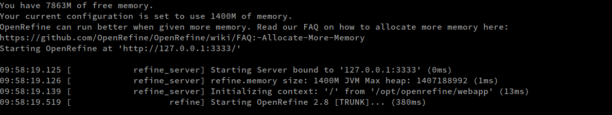
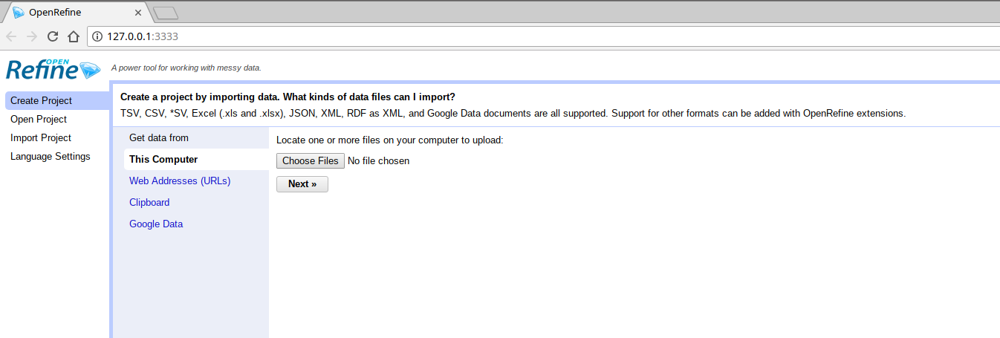
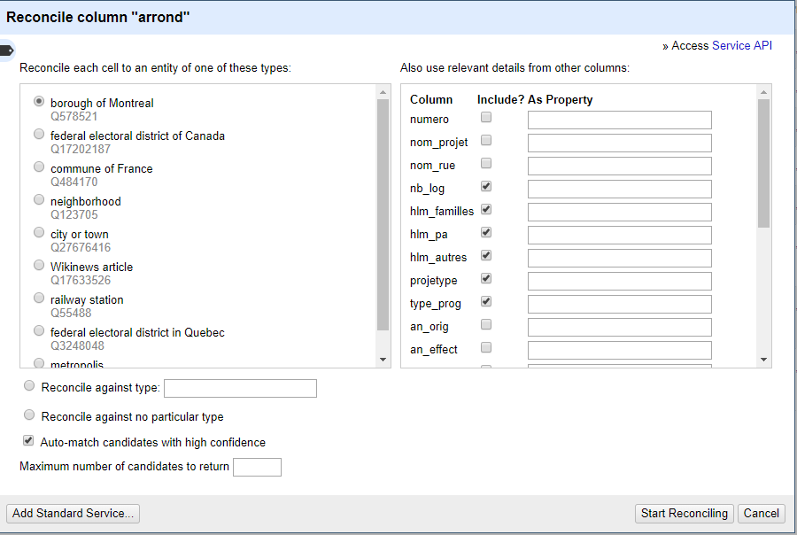
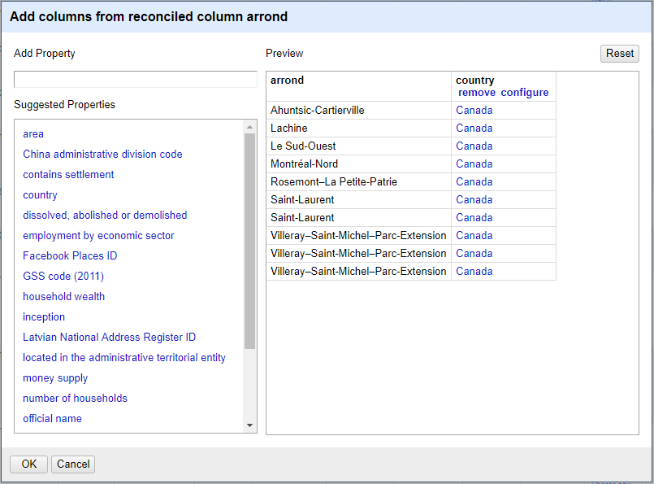

# Introduction to OpenRefine
For any questions or comments, please email me at julie.faure-lacroix@calculquebec.ca

You can download Openrefine here
[http://openrefine.org/](http://openrefine.org/)

## Why use OpenRefine?
1. to keep track of the changes made to the original dataset
2. because you can easily cancel an action
3. because OpenRefine does not modify the original file, it creates a copy
4. because you can save routines and apply it to other files
5. because it contains powerful aggregation algorithms

## Some notes on OpenRefine
1. OpenRefine was originally designed by Google under the name **Google Refine** and then became an open-source project under the name OpenRefine.
2. OpenRefine is a Java application and **a _sort_ of Java** has been developed especially for OpenRefine. This is a language called **GREL (General Refine Expression Language)**.
3. OpenRefine has a new **online forum** focused on using OpenRefine:

https://forum.openrefine.org/

> **THE DOCUMENTATION HAS IMPROVED A LOT but it's still worth watching the online forums**

4. OpenRefine is relatively efficient up to a limit of **1 million cells, 50 megabytes (MB)s or 50 columns per record**. You can improve this by allocating more memory https://docs.openrefine.org/manual/installing. A rule of thumb if you're running out of memory is to allocate 50% of however much memory you have left. That way you still have some wiggle room for all of your other computing needs. Do **NOT** allocate all of your available RAM or you'll run the risk of crashing your computer.
5. As the project is _open source_, there are several modified versions of OpenRefine which allow in particular to use files of millions of lines or to do the operations in parallel.
5. Today, we're using the internet but once you have OpenRefined installed, you don't need to be connected to the internet to use it.

## Installing OpenRefine
 
We'll be using OpenRefine on a remote server, however the following instructions apply when you are using OpenRefine on your personal computer. 

There is no software requirement to use OpenRefine. However, make sure that **Java** is installed and up to date. You'll be redirected to https://openrefine.org/docs/manual/installing#java when launching OpenRefine for the first time if you don't have the appropriate Java version.

You should have downloaded OpenRefine and extracted the files to a location on your computer.

When OpenRefine is launched, you should see a terminal (regardless of your operating system).



A web page should open. If not, open a browser and go to the address http://127.0.0.1:3333/.

### Extensions

You might want to install some extensions https://openrefine.org/extensions. If you choose to do so, you have 2 options:
1. You can install them in the program folder: They'll be erased with every new OpenRefine version. It is useful if you want to make sure that you have a version of the extension that matches the version of OpenRefine that you're using.
2. You can install them in your workspace: They won't go away with the next upgrade. It is useful if you want to keep a specific version of your extension regardless of the version of OpenRefine that you are using.

## Use OpenRefine
### The dataset
We will now retrieve data from **the open database of the city of Montreal**

[http://donnees.ville.montreal.qc.ca/dataset/declarations-exterminations-punaises-de-lit](http://donnees.ville.montreal.qc.ca/dataset/declarations-exterminations-punaises-de-lit)

These are bed bug declaration data from the Island of Montreal. Note the information mentioned on regarding the dataset:

> Statements by pest managers. The reporting forms have been submitted since July 5, 2011. The data have a low degree of reliability because they are entered manually by third parties, namely the pest managers and are not subject to any validation by the City of Montreal. [...] A single declaration in the reference district René-Lévesque during the year 2013 indicates 901 units treated, which is probably a typing error, and considerably increases the number of units treated.

So these are perfect data for a class!
On your personal computer, should have **extracted the csv file to your computer.**

On the server, we will let OpenRefine create a project directly from the dataset on the host server by using https://donnees.montreal.ca/dataset/49ff9fe4-eb30-4c1a-a30a-fca82d4f5c2f/resource/6173de60-c2da-4d63-bc75-0607cb8dcb74/download/declarations-exterminations-punaises-de-lit.csv

### Creating a project
OpenRefine can import several types of files: **tsv (tab separated), csv (comma separated), xls, xlsx, JSON, XML, RDF as XML, Google Spreadsheets**, etc.

1. In the **Home screen**, find **"Create Project"** tab 
2. Click **"Web Addresses (URLs)"** . We could choose to pick a local file but this time we'll fetch the dataset directly from the web. https://donnees.montreal.ca/dataset/49ff9fe4-eb30-4c1a-a30a-fca82d4f5c2f/resource/6173de60-c2da-4d63-bc75-0607cb8dcb74/download/declarations-exterminations-punaises-de-lit.csv

> Tip: It is convenient to select "Parse cell text into numbers, dates, ..." but if can use more memory than you'd expect. If you're dealing with a large dataset, you might want to leave that unchecked and convert strings as needed.

3. Click **"Next"**.
4. You be able to **preview the file**.
5. You can **change the encoding**, which may be interesting if you are working in windows (UTF-8).
6. Play around with the file separation types at the bottom to see the results.
7. If everything looks correct, give a name **to the copy of the file** and click **"Create Project"**. You can always change the name of your project in the project bar at the top of the screen.
8. In the next page, you'll see the **Project bar** at the top, where you can edit the name of your project.
9. Take a look at the column names in the grid.
9. In OpenRefine, changes are mostly made to **columns**. We can also see that there are **lines** and each piece of information is contained in a **cell**.



### Text filters
**Each column has a menu**. You can start by **"Text filter"** on the NOM_ARROND column. We can look for lots of words.

                                      
### Facetting
This is the most important step in OpenRefine. It will allow you to explore and familiarize yourself with the data. This is particularly useful when working with large datasets. Facetting allows you to get a **big picture of complex datasets** and to begin exploring them in more detail.

Facets allow you to ***aggregate*** certain data and make modifications to these groups of data.

#### Text Facets

Let us take the **first column with the name of the districts**. If we click the arrow and **Facets** then **Text Facet**, a box opens with the different writings of the names of the roundings.

> This dataset has improved massively over the yeard (sadly for me) but there are still a lot of accents and special characters that make it messy.

If we ***keep the word*** in the search box, we can create a facet just for that word. If we remove the text search, we have the entire arrondissements column. The total count for each borough next to their name gives us a quick overview.

>For example, if we type "Parc" in the filter box for NOM_QR, we find that neighboroods containing the word _Parc_ are found in Côte-des-neiges-Notre-Dame-de-grâce, Le Plateau-Mont-Royal, and Villeray-Saint-Michel-Parc-Extension

> If we changed a name directly in a cell, we would see the change in the facet.


### Numeric facet

In this dataset, we can use the number of exterminations (after transforming that column to number) in a numeric facet and see that the number of exterminations per declaration goes from 1 to 5. We can confirm this by appl
                                      
### Editing

You can **click directly inside a cell to manually change its content**. Let's change just one word and see what happens to our facet. You can also click "edit" on a facet and change all the cells that are part of the facet.

We can also ***code*** that step, especially when it involves several similar modifications on a large number of cells. For example, it is common to remove accents from datasets when working with datasets in foreign languages. It allows data to be shared with people for whom the locale would not allow the interpretation of certain special characters.

---
##### Exercise
For example, with GREL (the language of OpenRefine), the expression **value.replace ("é", "e")** replaces "é" with "e" in all the cells of the selected column. We can save the modification and see what happens.

> We could also write replace (value, "é", "e") and it is certainly more intuitive for someone who uses Excel or R, but it would not be the standard way to write it in GREL, which talks more to Python users for example.

We can add an infinite number of modifications by adding a point, then another modification. For example:

```value.replace (" é "," e ").replace(" Ville-Marie "," Ville-Mario ").replace("prev_word","new_word").modification (arguments)```
 

> An example that I personally like

```value.toLowercase().replace("à","a").replace("â","a").replace("á", "a").replace("ä","a").replace("è","e").replace("ê","e").replace("ë","e").replace("é","e").replace("ï","i").replace("î","i").replace("ô","o").replace("ö","o").replace("ü","u").replace("ù","u").replace("ç","c").replace("--","-").replace(" ", "").replace(".", "").replace(" ", "-").replace("/", "-").replace("–", "-").replace("'","")```

>Note the difference between "–" and "-". If you can't figure out how to type some characters with your keyboard, do not hesitate to copy-paste them from the overview.

You can select ***"retransform up to N times"*** to create loops that will attempt to retransform X number of times. Ex: useful with several consecutive "- - -", "- -", "-" ...

---

#### Reuse expressions
We can reuse commands already executed in the _history_ tab of the GREL interface. You can also star commands that you expect to use frequently.

---
##### Exercice

Reuse the previous expression on NOM_QR.

---

### Common transformations

### Data type
#### Change type
By default, OpenRefine reads all cells as strings. To perform operations on columns that are not strings, you must transform the cells to the appropriate type. To do this, you need to click the arrow to the left of the column name, then:
```Edit cells / Common transfroms```

and select the desired transform. The cells will appear in green when they are no longer strings.


#### Trim leading and trailing white spaces

When working with text, there are often cells with white space at the beginning and at the end. Always, always do it if you forgot to do it when first loading the file!

> This is another example of a modification that can be done with code:

``` value.trim () ```


#### Undo / Redo

Click on the **Undo / Redo** and **click on the step** where we created an error. We can go back in time to the point where we made a change we want to cancel. We can also move forward in time if we finally decide to go ahead with the modification. It is impossible to delete a single step in the middle of the entire process because each consecutive step depends on the previous ones.


### Groupings (_clustering_)

It is possible in Openrefine to identify typos and words written the way they sound. Algorithms are readily available in the menu **arrow / cluster and edit**

Several options are available and they are described here https://github.com/OpenRefine/OpenRefine/wiki/Clustering-In-Depth

1. key collision
    The fastest group of methods because the ***complexity is linear***. Method that creates an alternate representation of a value (or _key_) that contains only the core of a string. Then ***compares the keys with each other*** (_collision_) to find the ones that are identical.
    1.1. fingerprint
    Produces the ***fewest false positives***. Includes a series of steps which are outlined here: https://github.com/OpenRefine/OpenRefine/blob/master/main/src/com/google/refine/clustering/binning/FingerprintKeyer.java

    1.2. ngram-fingerprint (ngram size)
    ***Similar to fingerprint***. Choosing a very large n-gram size doesn't have much benefit, but a value of 1 or 2 can find combinations that fingerprint cannot find, while producing more false positives.
    
    1.3. metaphone3
    In ***English***. Use the pronunciation of words.
    
    1.4. cologne-phonetic
    In ***German***. Use the pronunciation of words.
    
2. next neighbor (kNN)
    Allows you to define a ***distance value between pairs of strings***. If two character strings fall within this distance, they will be agglomerated. Can take a very long time!
    
    2.1. levenshtein (radius, block chars)
    Measures the ***number of operations required to create the second string from the first one***. Good for typos, but setting a maximum long distance can slow down the computation considerably.
    
    2.2. ppm (radius, block chars)
    Implementation of a code to compare **DNA strings**. A method that generally produces a ***lot of false positives***.


If you identify a probable grouping, you can accept the default replacement or click one of the ways to write if the default replacement does not match the one you prefer. If there are several possible similar merges, we can do them all at once.

> The visual on the side can be useful if there are a lot of clusters and allows you to browse by cluster sizes.
                                      
---
##### Exercise
In the NOM_QR column, modify 3 "Beaurivage" cells as follows:
Borivage
Baurivage
Borrivage

Still in the district names box, click on **"Cluster"**. Cluster uses different text clustering algorithms.

Play with the different models and the different options. Fingerprint = precise, Phonetica = not precise, but magic.

You can then check **"merge"** and click **"Merge selected and recluster"** to see if the change affects anything, or **"Merge and close"** if you are happy with the changes.

---

### Create / Rename / Divide columns

When making drastic modifications to a column, it is possible to keep the original column intact in order to be able to assess whether the correct modifications have been made.

``` edit column / add column based on this column. ```

> You have to change the name. You can even edit cells directly.
                                      

---
##### Exercise
On column _NOM_QR_, clicj **split column into several colums**, separator -, split into 2 columns, and uncheck "Remove this column".

If we want to put the columns back together we can use the **join columns** option and check "Delete joined columns". 

Or do it manually **facet by blank on column 2** and on **column 3**. We will see that there are plenty of blanks in column 3. We will **select "False"** in the facet by blank. We're only going to have those who don't have a blank. We can now do _add column based on this column_ on the column _NOM_QR2 1_ and type
**value + "-" + cells ["NOM_QR2 2"]. value**

If after the fact you wanted to rename the column ...
**Change the names** of the columns: **arrow / edit column / rename column**

---


### Change the order of the columns, remove the columns

Sometimes a facet contains too many unique value to identify missing data at a glance. _Sort_ can help us with that.
---
##### Exercise
On "COORD_X", _Text Facet_. Do you think you'd be able to spot a missing coordinate or an error?

On "NBR_EXTERMINATION" converted to Number (or not, this would not make a difference), _Sort..._ and move _Blanks_ to the top in the right-hand box. 

### Remove empty cells
A common problem with messy datasets is the presence of empty cells. Are they data entry errors? Missing data? An absence of result? You decide. As for OpenRefine, it generally does not do well with empty cells and NAs. Ideally, you should do this processing before handling the data in OpenRefine. However, you have a few options if you don't.

> Ex: The Côte Saint-Luc is the Côte Saint-Luc. If we wanted to replace the empty boxes with Côte Saint-Luc for analysis purposes, we could.
Also, there are lines without start / end of processing. It's up to us to choose what that means. Did it turn out that there was no contamination? Have they never been treated? Was the inspector too scared to report some big hotel or business? Who knows...


#### Solution 1: delete

```Click facet by blank```

``` Set to True```

``` All / edit rows / remove all matching rows```

> We now have a smaller dataset.

                                      
#### Solution: replace with NA

Empty cells which are actually **NA's are quite problematic in OpenRefine**. Ideally, you would like to have done this step before using OpenRefine.

``` text facet by column```

```edit the facet blank to change to NA's```

The description mentions a single entry in 2013 in René-Lévesques noting 901 exterminations. Try to find this cell. What do you think? What does that tell you about the other empty cells? In this context, what would you choose to do with the empty cells?

### Include / exclude entries

We can decide to only work on the data of certain boroughs.

```click Ville-Marie to make it appear in orange```

```click include for Saint-Léonard and Villeray```
> We now have a data subset that we can export when we are done. Always remember that what you see is what you get. All excluded data will *not* be exported!


## Other facets

### Scatterplot facet
The locations are recorded using their latitude and longitude. After transforming them to numeric, we can use a scatterplot facet to have an idea of the areas most affected by bed bugs. It would also be a useful tool to detect outliers.


### Timeline facet

It is possible to organize the data by date rather than numerically. Just like the numerical facets, it is necessary to have previously changed the format of the column for date in order to be able to do the facetting.

***
Note: The conversion to date format may work randomly for you. It appears to be a problem with Java and your computer's time zone. Always check that the conversion produced the desired result!
***

##### Exercise
Replace a number "1" by the letter "l" in the DATE_FINTRAIT column.
Convert the column to a date. Identify the cell left in text in the column. Modify the cell and select the format _date_

A more stable solution is to use value.toDate("format") to convert manually if the default method does not give the expected results. For example, value.toDate("y") will extract the year only.

You can divide the columns to extract the start of the declaration date and remove the time.

```edit column / split into several columns```
> normally the ideal is to have a divider. Here we can take the "T" and 2 columns maximum.

```facet and click only on date```

```another facet on the column with the names```

```clusters to fix errors```

If we want to put the columns back together

```facet by blank on column 2 and on column 3```
> We will see that there are plenty of blanks in column 3.

```select "False" in the facet by blank. ```
> We're only going to have those who don't have a blank.

```value +" "+ cells [" col2 3] .value in column 1```
> Split [0] element 1, [1] element 2, [-1] last element

```Change column names: arrow / edit column / rename column```

---
#### More Facets

There are other customized facets, for example:

1. "Words" explodes a string and counts the occurrences of words
    
2. "Duplicates"
    
3. "Text length" counts the number of characters in a cell. Can be useful to find comments entered in a Yes / No cell
    
4. "Blanks"
    
    
### Transpose

This should come naturally to anyone used to Excel. There are 3 ways you can transpose data in OpenRefine:

1. _Transpose cells across columns into rows_  Useful when you receive "wide" datasets and you want to convert them to a "long" format. Select the columns you want to combine into one and pick either one column containing the values, or one column containing a key and one containing the values. Check "Fill down in other columns" to avoid getting empty cells.

2. _Transpose cells in rows into columns_  Useful when you have a column that has a repeated pattern eg: ABCABCABC. You select the number of cells to expand into columns.

3. _Columnize by key/value column_ To convert from "Long" to "Wide". You can even add columns containing comments!

### Data enhancement

#### Reconcile

Reconciliation is useful when we know of specific databases can be queried to enhance our dataset. Those databases have APIs specifically built to accept reconciliation with OpenRefine. You can choose a column that would contain unique identifiers that can be cross-referenced with the databases and choose:
```reconcile / start reconciling```

```choose Wikidata reconciliation for openrefine```
> if you can't find the database you need, you can add the relevant data to wikidata

```choose the required type, here Q578521```



The process is semi-automated because in some cases OpenRefine will not be able to reconcile the cells with the database and it will have to be done by hand. Normally this is quite fast because wikidata allows about 3 requests per second. Once the data has been reconciled, we can fetch the additional data available through the database.

```edit column / add columns from reconciled values```

and do some tests. In our case, we only have "Area" and "country" to look for. But you could choose a different database to get different results. We must also consider that we do not have a particular set of data suitable for reconciliation.



There are many ways to reconcile data depending on your specific needs, but to better understand the use of an API, we'll do the process manually with a database that isn't designed for reconciliation.

#### fetch URLs

We can enhance the dataset by adding columns containing information automatically found online. For example, we might want to use the name of the borough to find a geolocation or a geolocation to find the type of building or the name of the street. One of the best known options for accessing geolocation information is the Google maps API

[https://cloud.google.com/maps-platform/](https://cloud.google.com/maps-platform/)

However, the API is now free on a limited basis (with a number of credits offered upon registration), but it can get expensive to query their API. A free option is OpenStreetMap, which is OpenRefine's wishlist for reconciliation. If you ever implement a reconciliation API for OpenStreetMap, let us know!

[https://wiki.openstreetmap.org/wiki/API](https://wiki.openstreetmap.org/wiki/API)

Since this is an introduction, we will use a much simpler API. For the exercise, you may want to use the geolocation data from the inspections to determine the elevation of the location where the inspection took place. To do this, we will use Natural Resources Canada's elevation API that is only dedicated to elevation according to geolocation:

[http://geogratis.gc.ca/](http://geogratis.gc.ca)

Which we'll query using the latitude and longitude data we already have.
> it might be a good idea to do a numerical facet on the coordinates first to ensure that there were no typos and "points in the ocean".
 
 ```in column "latitude", add column based on column```

```name "query_api"```

```replace "value" with "http://geogratis.gc.ca/services/elevation/cdem/altitude?lat=" + value + "&lon=" + cells.LONGITUDE.value"```

> this gives us a URL that will allow us to fetch the information that the API allows us to obtain on the coordinates that we have selected, that is to say the elevation in this case.

When it's done, we have a column named query_api which will be the base to query the API. To do this,

```in column "query_api": edit column / add column by fetching URL```

```name query_result```

```throttle: 500 milliseconds```

> to give the server a break. Without this control from you, Openrefine will frantically query the API to get elevation data. It is therefore important to limit the number of requests per unit of time.

We then let the magic happen and a few seconds / minutes / hours later we should have a new column containing (almost) indecipherable text:

```{
    "altitude": 23.0,
    "vertex": true,
    "geometry": {"type":"Point","coordinates":[-73.74,45.4406]}
}
```

Since we only want to keep the value for "altitude", in this case 23.0, we need to tell OpenRefine what to do with the _query_result_ column.

```On column" query_result ": edit column / add column based on this column```

```value.parseJson().altitude```
which should return 23.


### Exporting
You can export your transformed dataset in a number of existing formats, such as CSV. Note that only the data selected in the facets will be exported. 

The **Export** icon allows you to export your project. There are plenty of available formats, but an interesting option is **"templating"**

#### as Template
This creates a **template in JSON format** which can be used for exporting to formats that are not yet supported by OpenRefine. The prefix and suffix are useful when we want to keep the JSON template. Otherwise, we can limit ourselves to putting text. The _jsonize_ part is also unnecessary unless you want to use JSON. This template can be used to share data in a context that does not require the full dataset, but rather a pleasant format for reading.

OpenRefine offers an example to export to YAML:
[https://github.com/OpenRefine/OpenRefine/wiki/Export-As-YAML](https://github.com/OpenRefine/OpenRefine/wiki/Export-As-YAML)

### Save project

You can save the entire project as a file, which you'll be able to share with collaborators. You'll see a .tar.gz file but don't worry, OpenRefine can read it just fine. All you have to do is send the entire thing so your collaborator can see the file and all the modification history. Note that if you have facets in your project, those facets won't be exported. 

### Reuse routines in the future

In the **undo / redo** tab, we can click extract and that will give us a JSON file that can be used for documentation or for reuse. We can select the parts we want to keep from our routine.

**copy paste into a text file** (avoid MS Word!)

and we can open a new project, a new file, return to undo / redo, click apply, copy and paste the code, click perform operations and voilà!
